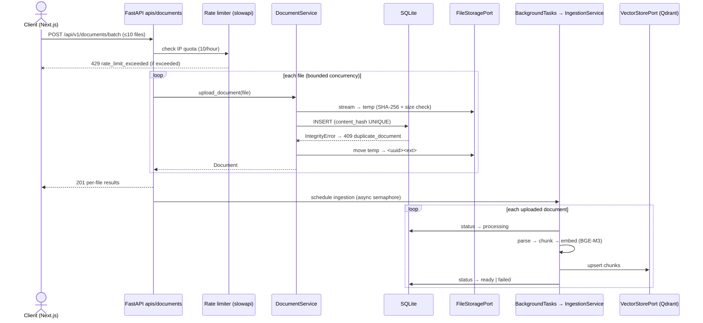
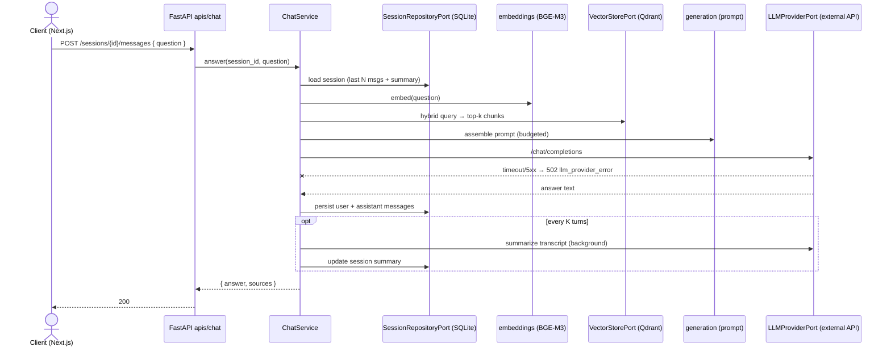

# API & Database Interactions

Parent: [../00-index.md](../00-index.md) · Spec: [../sdd.md](../sdd.md)

✅ = implemented · ⏳ = planned

## Sequence: Batch Upload

## Sequence: Chat Message (RAG)

## Endpoint ↔ DB/Store matrix

| Endpoint | SQLite | Filesystem | Qdrant | LLM API |
|---|---|---|---|---|
| `POST /documents` ✅ | insert document | write file | — | — |
| `POST /documents/batch` ✅ | insert ≤10 docs | write ≤10 files | (async) upsert | — |
| `GET /documents` ⏳ | select | — | — | — |
| `DELETE /documents/{id}` ⏳ | delete row | delete file | delete by document_id | — |
| `POST /chat/sessions` ✅ | insert session | — | — | — |
| `GET /chat/sessions` ✅ | select | — | — | — |
| `GET /sessions/{id}/messages` ✅ | select | — | — | — |
| `POST /sessions/{id}/messages` ✅ | read + insert | — | hybrid query | 1 call (+1 background summary) |

## Performance notes

- Upload response time is independent of ingestion cost — ingestion is backgrounded.
- Multi-file upload: per-file streaming + async semaphore; throughput bounded by disk
  and the embedding batch, not by file count linearly.
- Chat latency = 1 local embedding (~100–300 ms CPU) + 1 Qdrant query (~ms) +
  1 external LLM call (dominant).
