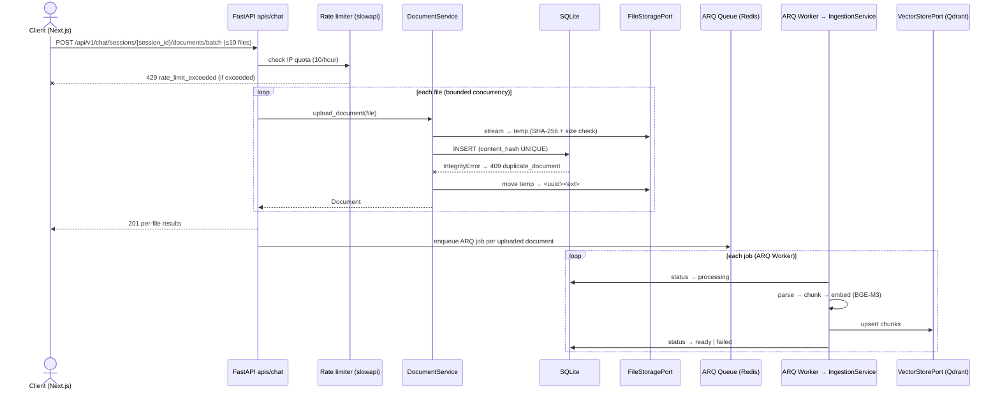
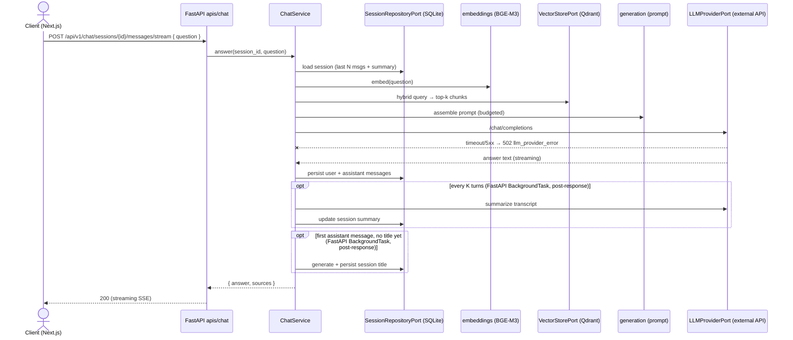

# API & Database Interactions

Parent: [../00-index.md](../00-index.md) · Spec: [../sdd.md](../sdd.md)

✅ = implemented · ⏳ = planned

## Sequence: Batch Upload

```mermaid
sequenceDiagram
    actor C as Client (Next.js)
    participant API as FastAPI apis/chat
    participant RL as Rate limiter (slowapi)
    participant SVC as DocumentService
    participant DB as SQLite
    participant FS as FileStoragePort
    participant Q as ARQ Queue (Redis)
    participant W as ARQ Worker → IngestionService
    participant QD as VectorStorePort (Qdrant)

    C->>API: POST /api/v1/chat/sessions/{session_id}/documents/batch (≤10 files)
    API->>RL: check IP quota (10/hour)
    RL--xC: 429 rate_limit_exceeded (if exceeded)
    loop each file (bounded concurrency)
        API->>SVC: upload_document(file)
        SVC->>FS: stream → temp (SHA-256 + size check)
        SVC->>DB: INSERT (content_hash UNIQUE)
        DB--xSVC: IntegrityError → 409 duplicate_document
        SVC->>FS: move temp → <uuid><ext>
        SVC-->>API: Document
    end
    API-->>C: 201 per-file results
    API->>Q: enqueue ARQ job per uploaded document
    loop each job (ARQ Worker)
        W->>DB: status → processing
        W->>W: parse → chunk → embed (BGE-M3)
        W->>QD: upsert chunks
        W->>DB: status → ready | failed
    end
```

## Sequence: Chat Message (RAG)

```mermaid
sequenceDiagram
    actor C as Client (Next.js)
    participant API as FastAPI apis/chat
    participant CS as ChatService
    participant SR as SessionRepositoryPort (SQLite)
    participant EMB as embeddings (BGE-M3)
    participant QD as VectorStorePort (Qdrant)
    participant GEN as generation (prompt)
    participant LLM as LLMProviderPort (external API)

    C->>API: POST /api/v1/chat/sessions/{id}/messages/stream { question }
    API->>CS: answer(session_id, question)
    CS->>SR: load session (last N msgs + summary)
    CS->>EMB: embed(question)
    CS->>QD: hybrid query → top-k chunks
    CS->>GEN: assemble prompt (budgeted)
    CS->>LLM: /chat/completions
    LLM--xCS: timeout/5xx → 502 llm_provider_error
    LLM-->>CS: answer text (streaming)
    CS->>SR: persist user + assistant messages
    opt every K turns (FastAPI BackgroundTask, post-response)
        CS->>LLM: summarize transcript
        CS->>SR: update session summary
    end
    opt first assistant message, no title yet (FastAPI BackgroundTask, post-response)
        CS->>SR: generate + persist session title
    end
    CS-->>API: { answer, sources }
    API-->>C: 200 (streaming SSE)
```

## Endpoint ↔ DB/Store matrix

| Endpoint | SQLite | Filesystem | Qdrant | LLM API |
|---|---|---|---|---|
| `GET /` ✅ | — | — | — | — |
| `GET /healthz` ✅ | — | — | — | — |
| `GET /readyz` ✅ | — | — | Qdrant ping | — |
| `GET /api/v1/system/config` ✅ | — | — | — | — |
| `POST /api/v1/chat/sessions` ✅ | insert session | — | — | — |
| `GET /api/v1/chat/sessions` ✅ | select | — | — | — |
| `GET /api/v1/chat/sessions/{id}` ✅ | select | — | — | — |
| `DELETE /api/v1/chat/sessions/{id}` ✅ | delete session + docs | delete doc files | delete by document_id | — |
| `GET /api/v1/chat/sessions/{id}/messages` ✅ | select | — | — | — |
| `POST /api/v1/chat/sessions/{id}/messages/stream` ✅ | read + insert | — | hybrid query | 1 call (+1 background summary) |
| `POST /api/v1/chat/sessions/{id}/documents/batch` ✅ | insert ≤10 docs | write ≤10 files | (ARQ async) upsert | — |
| `GET /api/v1/chat/sessions/{id}/documents` ✅ | select | — | — | — |
| `DELETE /api/v1/documents/{id}` ✅ | delete row | delete file | delete by document_id | — |
| `POST /api/v1/documents/{id}/retry` ✅ | update status | — | (ARQ async) upsert | — |

## Performance notes

- Upload response time is independent of ingestion cost — ingestion is ARQ-enqueued.
- Multi-file upload: per-file streaming + async semaphore; throughput bounded by disk
  and the embedding batch, not by file count linearly.
- Chat latency = 1 local embedding (~100–300 ms CPU) + 1 Qdrant query (~ms) +
  1 external LLM call (dominant).
