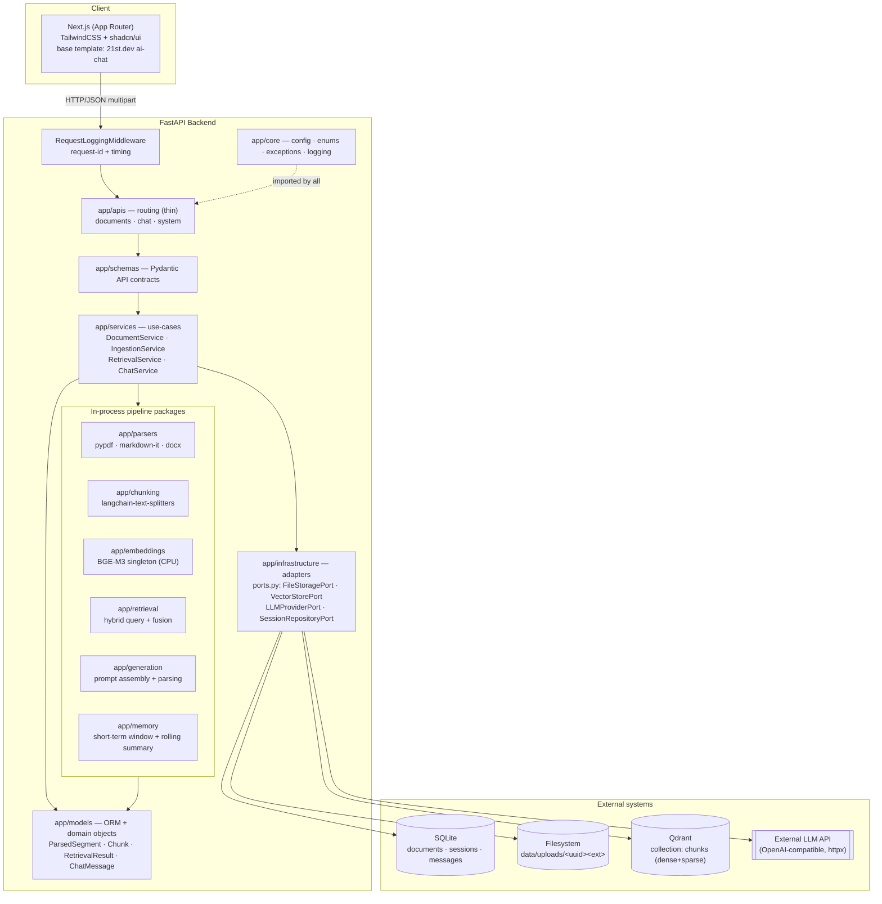

# System Architecture

Parent: [../00-index.md](../00-index.md) · Spec: [../sdd.md](../sdd.md)

## Layered Architecture



## Hardware Budget (16 GB RAM, no GPU inference)

| Component | RAM footprint | Notes |
|---|---|---|
| FastAPI + SQLAlchemy | ~150 MB | async, negligible |
| BGE-M3 (sentence-transformers) | ~2–3 GB | lazy singleton, loaded once |
| Reranker v2-m3 (deferred) | ~2 GB | only when its stage arrives |
| Qdrant (Docker) | ~200–500 MB | on-disk storage |
| LLM | 0 | external API |
| **Headroom** | **> 9 GB free** | safe |

## Dependency Direction (strict)

```
apis → schemas → services → pipeline packages → models
                   │
                   └→ infrastructure (ports) → core
core imports nothing from other layers
```

Violating this direction is a defect — flag it, don't do it.
