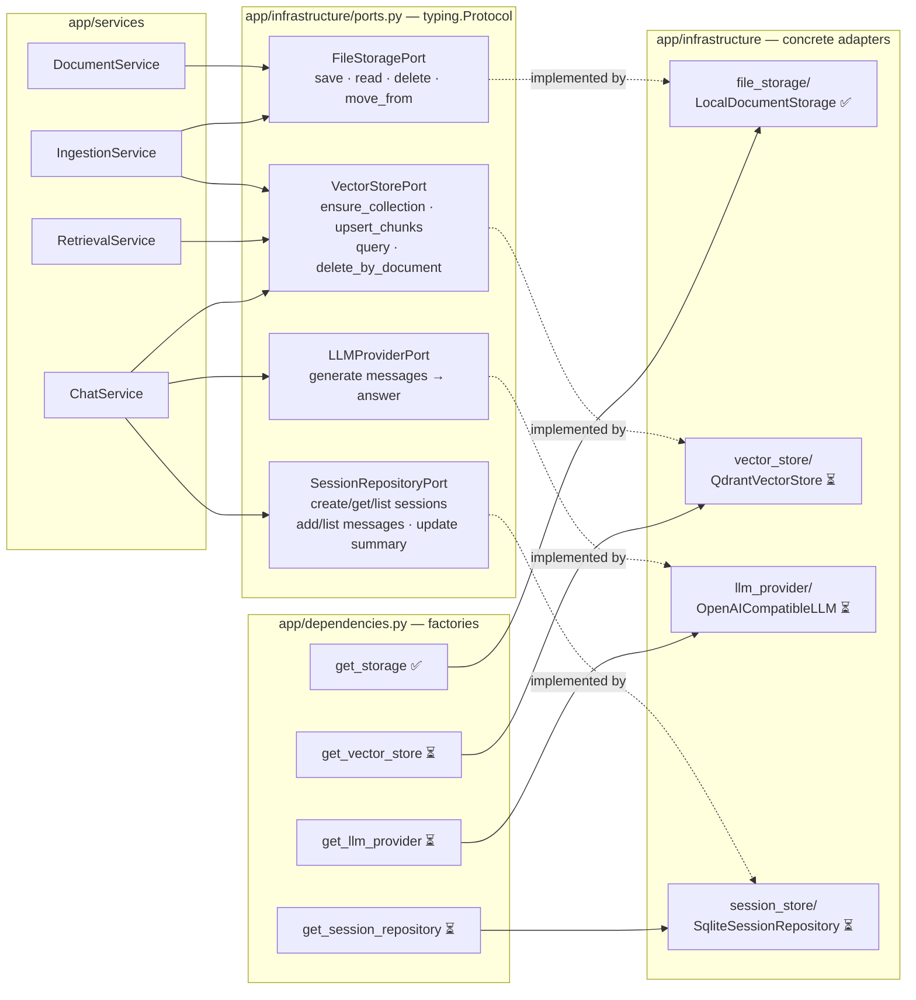

# Component Design — Ports & Adapters

Parent: [../00-index.md](../00-index.md) · Spec: [../sdd.md](../sdd.md)

Every external system sits behind a **Port** (`typing.Protocol` in
`app/infrastructure/ports.py`). Services depend on ports only. **Factories** in
`app/dependencies.py` pick the adapter from `Settings`. Swapping an adapter touches
the adapter + factory only — never a service.

## Ports and Adapters

## Swap table

| Port | Now | Later | Cost to swap |
|---|---|---|---|
| `FileStoragePort` | Local filesystem ✅ | S3/MinIO | new adapter + factory branch |
| `VectorStorePort` | Qdrant | any vector DB | new adapter + factory branch |
| `LLMProviderPort` | OpenAI-compatible API | any provider | new adapter + factory branch |
| `SessionRepositoryPort` | SQLite | PostgreSQL | new adapter + factory branch |

## Module Communication

- **In-process modules** (`parsers`, `chunking`, `embeddings`, `memory`, `retrieval`,
  `generation`): direct typed calls exchanging domain objects from `app/models`
  (`ParsedSegment`, `Chunk`, `RetrievalResult`, `ChatMessage`). No DTO ceremony.
- **Client ↔ Backend:** HTTP/JSON; uploads are `multipart/form-data`.
- **Backend ↔ Qdrant:** `qdrant-client` (gRPC/HTTP); hybrid fusion via Qdrant's
  native Query API — **never** reimplemented in Python.
- **Backend ↔ LLM:** `httpx.AsyncClient` against an OpenAI-compatible
  `/chat/completions` endpoint; API key from `Settings`, never in code.
- **Background work:** FastAPI `BackgroundTasks` for ingestion (MVP). No Celery/Redis.

## Modularity Rules

- A service never imports an adapter class — only ports and factories.
- `embeddings` exposes one singleton accessor (`get_embedding_model()`); nothing else
  may import `sentence_transformers` directly.
- Each pipeline package has exactly one public entry point used by services.
