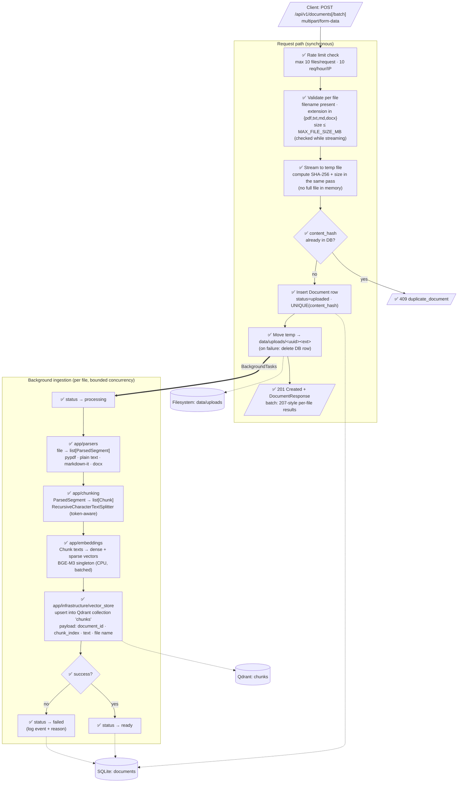

# Data Flow — Ingestion Pipeline (DFD)

Parent: [../00-index.md](../00-index.md) · Spec: [../sdd.md](../sdd.md)

How a file moves through the system, from upload to searchable vectors.
✅ = implemented

## Rules encoded in this flow

1. **Dedup by content, not name** — SHA-256 of the bytes; renamed duplicates are rejected. ✅
2. **No orphan state** — temp file deleted on any failure; DB row deleted if the final move fails. ✅
3. **Multi-file ≠ slow** — batch endpoint streams each file independently and runs
   ingestion with an async semaphore (bounded concurrency), so N files don't mean N× latency. ✅
4. **One pipeline pass** — `IngestionService` runs parse→chunk→embed→upsert once per
   document; no stage recomputes another's output.
5. **Failure visibility** — ingestion errors never leak to the upload response (client
   already has its 201); they surface as `status=failed` + structured logs.
