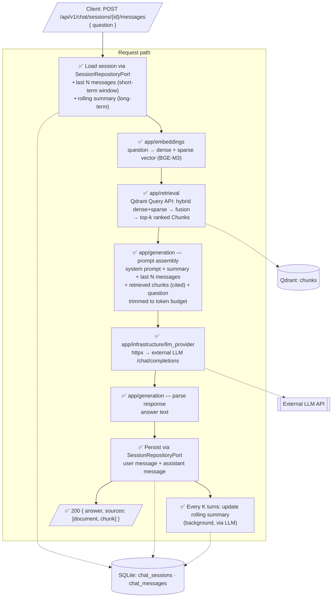

# Data Flow — Query / Chat Pipeline (DFD)

Parent: [../00-index.md](../00-index.md) · Spec: [../sdd.md](../sdd.md)

How a user question becomes an answer, with memory. All stages ✅ (implemented).

## Memory model (best practice for this scale)

| Layer | Storage | Content | Lifetime |
|---|---|---|---|
| Short-term window | SQLite `chat_messages` | last N messages verbatim (N from Settings) | per session |
| Long-term summary | SQLite `chat_sessions.summary` | rolling LLM-written summary, updated every K turns | per session |
| Semantic memory 🔒 deferred | Qdrant `chat_memory` collection | embedded past Q&A pairs | cross-session |

Prompt budget order (fill until token limit):
`system prompt → rolling summary → retrieved chunks → last N messages → question`

## Rules encoded in this flow

1. **Session isolation** — history and summary are loaded by `session_id` only; one
   session never sees another's messages.
2. **Retrieval scope** — queries search all documents with `status=ready`.
3. **Sources are first-class** — every answer carries the chunks it was built from
   (document name + chunk index) so the UI can cite them.
4. **Summary updates never block the response** — they run after the answer is saved.
5. **LLM failure** → `502 llm_provider_error` with the standard error shape; the user
   message is still persisted so history stays truthful.
