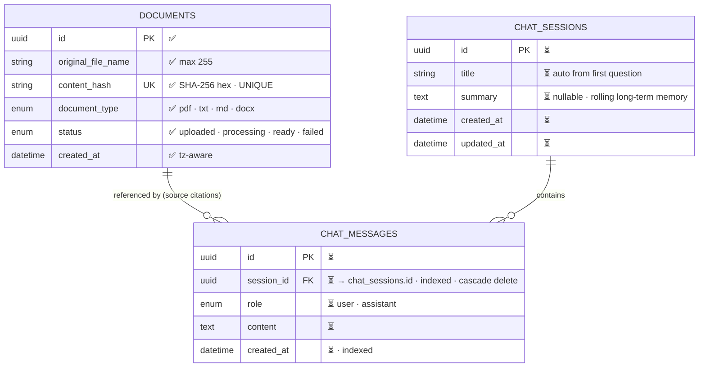
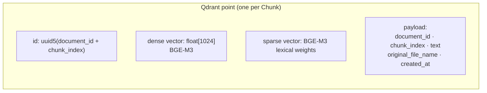

# Data Schema — ERD & Vector Payload

Parent: [../00-index.md](../00-index.md) · Spec: [../sdd.md](../sdd.md)

✅ = implemented (migration exists) · ⏳ = planned · 🔒 = deferred

## SQLite — Entity Relationship

**Constraint notes**
- `documents.content_hash` UNIQUE is enforced at the DB level — dedup correctness
  does not depend on application code alone. ✅
- `chat_messages.session_id` gets an index; deleting a session cascades to its messages.
- Vectors are **not** stored in SQLite. Chunks live in Qdrant; the link is
  `document_id` + `chunk_index` in the payload.

## Qdrant — Collection `chunks` ✅

- Distance: cosine (dense); sparse via Qdrant sparse vectors.
- Hybrid: one Query API call with prefetch (dense + sparse) → **RRF fusion** — done
  inside Qdrant, never in Python.
- Deleting a document = delete points where `payload.document_id = <id>`.

## Qdrant — Collection `chat_memory` 🔒 deferred

Embedded past Q&A pairs for cross-session semantic recall. Exists only from the
semantic-memory stage onward.

## Domain value objects (`app/models`, in-memory only)

| Object | Fields | Producer → Consumer |
|---|---|---|
| `ParsedSegment` | text, page?, section? | parsers → chunking |
| `Chunk` | text, document_id, chunk_index | chunking → embeddings → vector store |
| `RetrievalResult` | chunk, score | retrieval → generation |
| `ChatMessage` | role, content, created_at | memory → generation |
