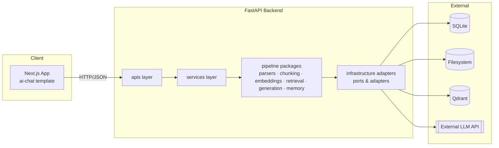

# Software Design Document (SDD) — RAG System

> **This document is the Single Source of Truth (SST).**
> If code and this document disagree, the code is wrong — fix the code or
> explicitly update this document in the same change.
> To change a feature's behavior, **edit the spec first**, then let the agent
> re-implement from the spec. This eliminates hallucination, maintains context,
> and keeps development velocity high (you review and verify; the agent implements).

Parent: [00-index.md](00-index.md) · Rules: [../AGENTS.md](../AGENTS.md)

---

## 1. Goal

A high-performance RAG system that ingests **multiple files of multiple types**
without performance degradation, stores them in Qdrant, and answers questions over
them through **multi-session chat** with proper short/long-term memory.

End user: a single local user (MVP) chatting with their document collection via a
Next.js web UI.

---

## 2. System Architecture

Full detail: [diagrams/architecture.md](diagrams/architecture.md).

---

## 3. Component Design

Full detail: [diagrams/component-design.md](diagrams/component-design.md).

- All external systems behind **ports** (`typing.Protocol`) in `app/infrastructure/ports.py`.
- **Factories** in `app/dependencies.py` select adapters from `Settings`.
- Communication: synchronous in-process calls between modules; HTTP only at the
  outer boundary (client ↔ backend, backend ↔ LLM API, backend ↔ Qdrant).

---

## 4. Data Flow (DFD)

- Ingestion: [diagrams/data-flow-ingestion.md](diagrams/data-flow-ingestion.md)
- Query: [diagrams/data-flow-query.md](diagrams/data-flow-query.md)

**Ingestion lifecycle:**
`Upload → validate (type/size/rate) → stream to temp + SHA-256 → dedup check →
DB record (status=uploaded) → move to final path → background: parse → chunk →
embed (BGE-M3 dense+sparse) → upsert Qdrant → status=ready (or failed)`

**Query lifecycle:**
`Question → load session (short-term window + rolling summary) → embed query →
Qdrant hybrid query (Query API fusion) → assemble prompt (system + memory +
chunks + question) → external LLM → persist messages → answer`

---

## 5. Data Schema

Full detail: [diagrams/data-schema.md](diagrams/data-schema.md).

**SQLite (SQLAlchemy + Alembic):**
- `documents` ✅ implemented — id (UUID PK), original_file_name, content_hash (UNIQUE), document_type, status, created_at
- `chat_sessions` ✅ — id (UUID PK), title, summary (nullable), created_at, updated_at
- `chat_messages` ✅ — id (UUID PK), session_id (FK → chat_sessions), role, content, created_at

**Qdrant:**
- Collection `chunks` ✅ — dense vector (BGE-M3, 1024-dim) + sparse vector; payload: document_id, chunk_index, text, original_file_name
- Collection `chat_memory` 🔒 deferred (semantic long-term memory stage)

---

## 6. API Contract

Full detail: [diagrams/api-interactions.md](diagrams/api-interactions.md).

| Endpoint | Status | Purpose |
|---|---|---|
| `GET /` | ✅ | App metadata |
| `POST /api/v1/chat/sessions/{id}/documents` | ✅ | Upload one document |
| `POST /api/v1/chat/sessions/{id}/documents/batch` | ✅ | Upload up to 10 files, rate-limited 10/hour/IP |
| `GET /api/v1/chat/sessions/{id}/documents` | ✅ | List documents |
| `DELETE /api/v1/documents/{id}` | ✅ | Delete document + its vectors |
| `POST /api/v1/chat/sessions` | ✅ | Create chat session |
| `GET /api/v1/chat/sessions` | ✅ | List sessions |
| `DELETE /api/v1/chat/sessions/{id}` | ✅ | Delete session + docs + vectors |
| `GET /api/v1/chat/sessions/{id}/messages` | ✅ | Session history |
| `POST /api/v1/chat/sessions/{id}/messages` | ✅ | Ask question → RAG answer |

All errors use the standard shape: `{"error": {"code", "message", "details?", "request_id?"}}`.

---

## 7. Business Rules

1. **Deduplication:** identical content (SHA-256) is never stored twice, regardless of filename → `409 duplicate_document`. ✅ implemented
2. **Rate limiting:** max 10 files per batch request; 10 upload requests/hour/IP. ✅ implemented
3. **Upload → ingestion decoupling:** upload returns `201` immediately with `status=uploaded`; ingestion runs as a background task and flips status to `ready`/`failed`. ✅ implemented
4. **Client filenames are never filesystem paths.** Physical name = `<uuid><ext>`. ✅ implemented
5. **Session isolation:** retrieval is scoped to all ready documents; chat history is scoped to its session only.
6. **Memory budget:** prompt = system + summary + last N messages + retrieved chunks, trimmed to the model's context budget before sending.

---

## 8. Error Cases (canonical)

| Condition | HTTP | Code |
|---|---|---|
| Missing filename | 400 | `missing_filename` ✅ |
| Unsupported type | 422 | `unsupported_document_type` ✅ |
| File too large | 413 | `file_too_large` ✅ |
| Duplicate content | 409 | `duplicate_document` ✅ |
| Rate limit hit | 429 | `rate_limit_exceeded` ✅ |
| Not found (doc/session) | 404 | `not_found` ✅ |
| Storage failure | 500 | `storage_error` ✅ |
| LLM provider failure | 502 | `llm_provider_error` ✅ |
| Ingestion failure | document status → `failed` (no HTTP error to client) | ✅ |

---

## 9. Current State

**Implemented ✅**
- FastAPI app factory, request logging middleware, unified exception handlers
- Settings (pydantic-settings), SQLite async engine/session
- `Document` model + Alembic migration
- Single-file and batch upload with streaming, SHA-256 dedup, size limits, and `slowapi` rate limiting
- Local filesystem storage adapter
- Background ingestion pipeline (parsing, chunking, batched BGE-M3 embeddings, Qdrant hybrid vectors upsert)
- Chat sessions, short-term and summary memory, hybrid retrieval fusion, and context-budget generation via Groq API
- Document Management endpoints (list and complete deletion across DB, File, and Vector Store)

**Not yet implemented** — see [progress/roadmap.md](progress/roadmap.md).

---

## 10. Known Issues / Risks

- BGE-M3 first load downloads ~2 GB and occupies ~2–3 GB RAM — lazy singleton implemented.
- SQLite is fine at MVP scale; the session repository port exists so it can be swapped.
- No auth — MVP is single-user local. Do not expose beyond localhost.
